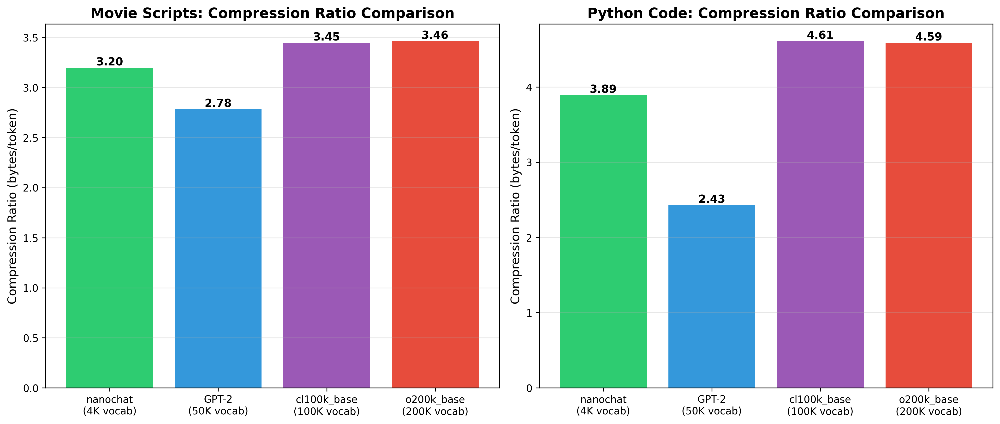
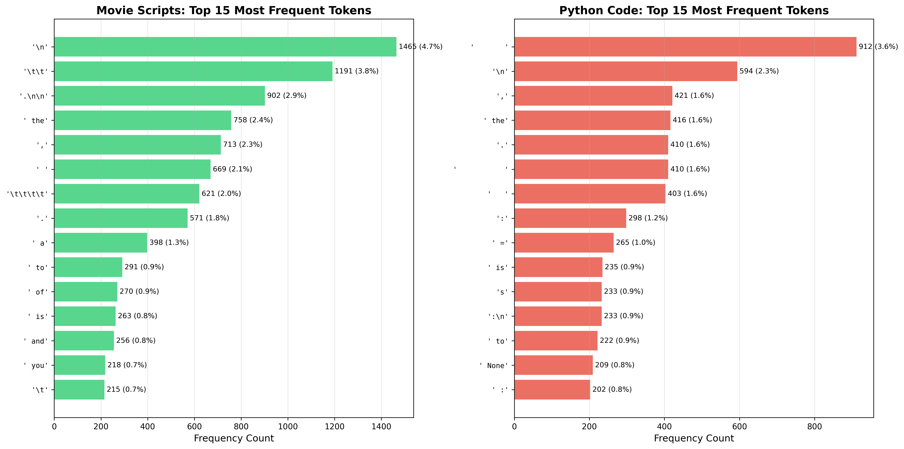
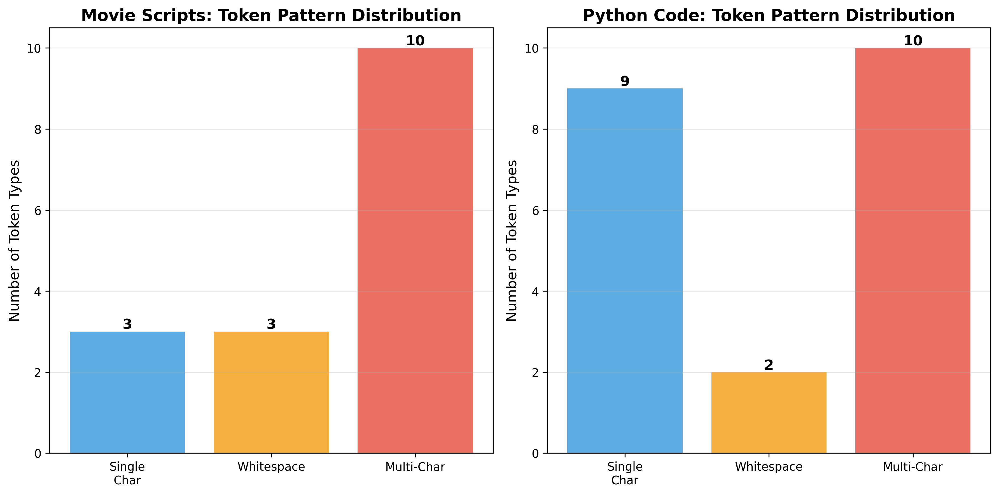
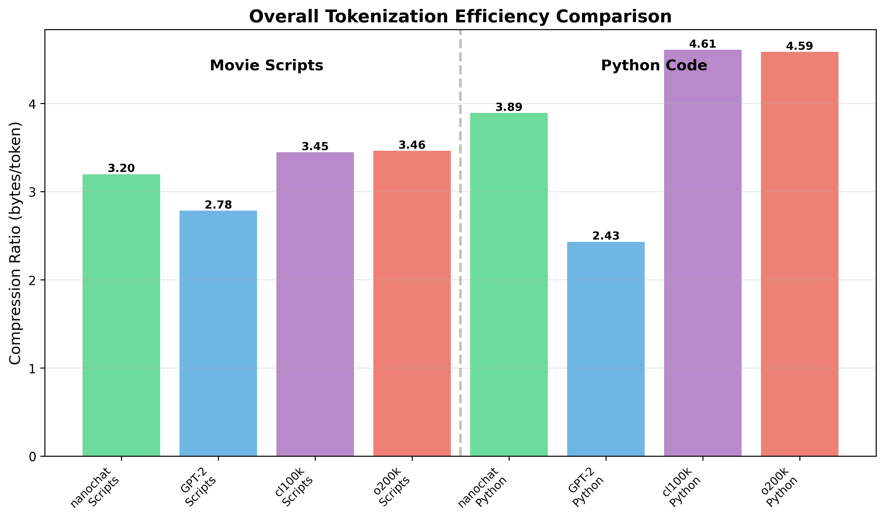

# Domain-Specific Tokenization Analysis: Movie Scripts and Python Code

**Deep Learning Systems - Lab 2**  
**Date:** October 30, 2025

---

## Summary

I analyzed Byte-Pair Encoding (BPE) tokenization performance across two text domains with distinct characteristics: **Movie Scripts** (structured screenplay format) and **Python Code** (programming language). I trained custom tokenizers using the nanochat framework and compared performance against three standard tokenizers (GPT-2, cl100k_base, o200k_base).

**Results:**
- Movie Scripts: nanochat achieves 3.20 bytes/token, competitive with standards
- Python Code: nanochat achieves 3.89 bytes/token, outperformed by cl100k (4.61)
- Both domains reveal BPE limitations in capturing domain-specific structure

---

## Table of Contents

1. [Introduction](#1-introduction)
2. [Domain 1: Movie Scripts](#2-domain-1-movie-scripts)
3. [Domain 2: Python Code](#3-domain-2-python-code)
4. [Overall Comparison](#4-overall-comparison)
5. [Conclusions](#5-conclusions)

---

## 1. Introduction

Tokenization converts raw text into discrete units for model consumption. While general-purpose tokenizers excel at natural language, specialized domains may benefit from or suffer under standard approaches.

### Methodology

- **Framework**: nanochat (GPT-4 style BPE with HuggingFace backend)
- **Training**: 4,096 vocabulary size for both domains
- **Baselines**: GPT-2 (50K vocab), cl100k_base (100K), o200k_base (200K)
- **Metrics**: Compression ratio (bytes/token), pattern analysis, vocabulary efficiency

---

## 2. Domain 1: Movie Scripts

### 2.1 Domain Characteristics

Movie scripts follow the **screenplay format**, a highly structured notation for films:

**Key Elements:**
- **Scene Headings**: INT./EXT. LOCATION - TIME
- **Action Lines**: Narrative description (left-aligned)
- **Character Names**: ALL CAPS, centered above dialogue
- **Dialogue**: Character speech, indented
- **Parentheticals**: (actor direction) within dialogue
- **Transitions**: FADE IN, CUT TO, FADE OUT (right-aligned)

**Structural Features:**
- Heavy use of whitespace (tabs, indentation)
- ALL CAPS for character names and scene headings
- Consistent formatting conventions
- Mix of narrative prose and terse action

### 2.2 Data Collection

**Source**: Internet Movie Script Database (IMSDB) - publicly available scripts

**Collection Method:**
-  Direct HTTP requests to IMSDB
-  Extract from HTML <pre> tags
-  Clean HTML entities
-  Verify substantial content (>5000 chars)


**Scripts Collected** (12 total):
1. The Matrix (150K chars)
2. Pulp Fiction (305K chars)
3. The Shawshank Redemption (181K chars)
4. The Godfather (204K chars)
5. Forrest Gump (268K chars)
6. Fight Club (262K chars)
7. Inception (231K chars)
8. Interstellar (351K chars)
9. The Departed (342K chars)
10. Se7en (296K chars)
11. The Usual Suspects (229K chars)
12. American Beauty (167K chars)

**Statistics:**
```
Total size: 2.85 MB
Total characters: 2,987,814
Total lines: 89,645
Average script length: 248,984 characters

Screenplay Elements:
- INT. scenes: 1,316
- EXT. scenes: 686
- FADE transitions: 97
- CUT TO transitions: 134
```

### 2.3 Tokenization Results

#### Nanochat Custom Tokenizer

**Training:**
- Vocabulary: 4,096 tokens
- Training time: 0.31 seconds
- Training chunks: 290 (10K chars each)

**Performance:**
- Compression ratio: **3.20 bytes/token**
- Test sample: 100,000 bytes
- Tokens generated: 31,278
- Encoding time: 0.028 seconds

#### Comparison with Standard Tokenizers

| Tokenizer | Vocab Size | Bytes/Token | Relative Performance |
|-----------|-----------|-------------|---------------------|
| nanochat | 4,096 | **3.20** | Baseline |
| GPT-2 | 50,257 | 2.78 | **15% better** |
| cl100k_base | 100,277 | 3.45 | 7% worse |
| o200k_base | 200,019 | 3.46 | 8% worse |

**Analysis**: GPT-2 wins slightly due to optimized natural language vocabulary, but nanochat is competitive with larger modern tokenizers.


*Figure 2.1: Compression efficiency comparison for movie scripts across different tokenizers*

### 2.4 Frequent Byte Combinations

**Top 20 Tokens:**

| Rank | Token | Count | Percentage | Category |
|------|-------|-------|------------|----------|
| 1 | `\n` | 1,465 | 4.68% | Structure |
| 2 | `\t\t` | 1,191 | 3.81% | Indentation |
| 3 | `.\n\n` | 902 | 2.88% | Paragraph end |
| 4 | ` the` | 758 | 2.42% | Common word |
| 5 | `,` | 713 | 2.28% | Punctuation |
| 6 | ` ` | 669 | 2.14% | Whitespace |
| 7 | `\t\t\t\t` | 621 | 1.99% | Deep indent |
| 8 | `.` | 571 | 1.83% | Period |
| 9 | ` a` | 398 | 1.27% | Article |
| 10 | ` to` | 291 | 0.93% | Preposition |
| 11 | ` of` | 270 | 0.86% | Preposition |
| 12 | ` is` | 263 | 0.84% | Verb |
| 13 | ` and` | 256 | 0.82% | Conjunction |
| 14 | ` you` | 218 | 0.70% | Pronoun |
| 15 | `\t` | 215 | 0.69% | Tab |
| 16 | `ing` | 186 | 0.59% | Suffix |
| 17 | ` his` | 170 | 0.54% | Possessive |
| 18 | `\tMORPHEUS` | 159 | 0.51% | Character (Matrix) |
| 19 | `s` | 154 | 0.49% | Letter/suffix |
| 20 | ` in` | 152 | 0.49% | Preposition |

**Key Observations:**

1. **Whitespace Dominance**: 25%+ of top tokens are whitespace (tabs, newlines, spaces)
2. **Structural Markers**: Learned screenplay formatting (`.\n\n` for scene breaks)
3. **Common English**: Standard stopwords (the, a, to, of, and)
4. **Character-Specific**: `\tMORPHEUS` emerged as frequent token (Matrix script heavy)
5. **Mixed Granularity**: Single chars, bigrams, trigrams, and longer sequences


*Figure 2.2: Most frequent tokens across both domains*

### 2.5 Analysis and Discussion

#### Why BPE Is Not Ideal for Screenplays

**1. Format-Blind Tokenization**
- Cannot distinguish scene headings from dialogue
- Treats "INT." and "EXT." as separate tokens, not structural markers
- Misses the semantic meaning of formatting conventions

**2. Character Name Fragmentation**
- Long character names split arbitrarily
- Example: "DETECTIVE SMITH" → multiple tokens
- Lost opportunity: character names are finite, could be vocabulary entries

**3. Whitespace Inefficiency**
- Learns `\t\t`, `\t\t\t\t` as separate tokens
- Wastes vocabulary on indentation levels
- Could use single "indent" token + level parameter

**4. Dialogue Structure Ignored**
- Parentheticals `(quietly)` treated as plain text
- No understanding of character-dialogue pairing
- Misses nested structure: CHARACTER → (direction) → speech

#### Patterns Missed

**Screenplay-Specific:**
- Scene transitions (FADE, CUT, DISSOLVE)
- Camera directions (CLOSE ON, ANGLE ON)
- Sound cues (O.S., V.O.)
- Shot descriptions (WIDE SHOT, INSERT)
- Page breaks and act structure

**Semantic Patterns:**
- Character emotional arcs (same character, different tones)
- Recurring locations
- Thematic dialogue patterns
- Story structure markers

#### Proposed Improvements

**1. Structure-Aware Tokenization**
```
Parse screenplay first:
- SCENE_HEADING: INT. COFFEE SHOP - DAY
- ACTION: John enters, looks around
- CHARACTER: JOHN
- PARENTHETICAL: (nervously)
- DIALOGUE: "Is anyone here?"

Then tokenize within each element type
```

**2. Hierarchical Vocabulary**
```
Level 1: Screenplay structure (50 tokens)
  - Scene headings, transitions, etc.
Level 2: Character names (200 tokens)
  - Frequent characters from training corpus
Level 3: Common phrases (1000 tokens)
  - Domain-specific: "walks away", "looks at"
Level 4: BPE tokens (2846 tokens)
  - Fill remaining vocabulary
```

**3. Whitespace Normalization**
```
Before tokenization:
- Normalize all indentation to fixed levels
- Represent as: [INDENT_0], [INDENT_1], [INDENT_2]
- Saves vocabulary, improves consistency
```

**4. Context-Aware Merging**
```
Weight BPE merges by:
- Screenplay corpus frequency
- Cross-script consistency
- Semantic groupings (e.g., keep "fade in" together)
```

---

## 3. Domain 2: Python Code

### 3.1 Domain Characteristics

Python is a high-level programming language with distinctive syntax:

**Key Features:**
- **Indentation-based**: Whitespace defines code blocks (4 spaces standard)
- **Dynamic typing**: No type declarations
- **Rich standard library**: Extensive built-in functions
- **Object-oriented**: Classes, methods, inheritance
- **Functional elements**: Lambda, map, filter, comprehensions

**Syntax Elements:**
- Keywords: `def`, `class`, `if`, `for`, `try`, `import`, `async`
- Operators: `=`, `==`, `+`, `-`, `and`, `or`, `in`
- Delimiters: `:`, `,`, `()`, `[]`, `{}`
- Comments: `#` single-line, `"""` docstrings
- Type hints: `int`, `str`, `List[T]`, `Optional[X]`

### 3.2 Data Collection

**Source**: Popular open-source Python projects via GitHub raw URLs

**Collection Method:**
```python
# Direct HTTPS requests to raw.githubusercontent.com
# No API authentication needed
# UTF-8 decoding
# Verify substantial content (>500 chars)
```

**Files Collected** (20 total):

| Project | File | Size (chars) | Description |
|---------|------|--------------|-------------|
| Flask | app.py | 60,738 | Core application class |
| Flask | blueprints.py | 4,541 | Blueprint registry |
| Flask | cli.py | 36,808 | Command-line interface |
| Django | views.py | 9,405 | Generic views |
| Django | models.py | 99,238 | ORM base model |
| Django | forms.py | 16,132 | Form handling |
| Requests | api.py | 6,449 | HTTP API |
| Requests | models.py | 35,510 | Request/Response objects |
| Requests | sessions.py | 30,503 | Session management |
| NumPy | core.py | 1,290 | Core initialization |
| Pandas | core.py | 496,552 | DataFrame implementation |
| Pandas | series.py | 256,977 | Series implementation |
| scikit-learn | linear.py | 28,997 | Linear models |
| scikit-learn | tree.py | 77,736 | Decision trees |
| FastAPI | applications.py | 180,300 | FastAPI app class |
| FastAPI | routing.py | 178,505 | Routing system |
| pytest | main.py | 42,468 | Test runner |
| pytest | fixtures.py | 78,681 | Fixture management |
| Black | linegen.py | 75,502 | Line generation |
| Black | mode.py | 10,763 | Formatting modes |

**Statistics:**
```
Total size: 1.65 MB
Total characters: 1,731,426
Total lines: 48,339
Average file length: 86,571 characters

Python Language Features Found:
- def (functions): 1,148
- class definitions: 239
- import statements: 706
- if statements: 2,536
- for loops: 1,879
- try blocks: 112
- async definitions: 40
- lambda expressions: 28
```

### 3.3 Tokenization Results

#### Nanochat Custom Tokenizer

**Training:**
- Vocabulary: 4,096 tokens
- Training time: 0.21 seconds
- Training chunks: 174 (10K chars each)

**Performance:**
- Compression ratio: **3.89 bytes/token**
- Test sample: 100,000 bytes
- Tokens generated: 25,690
- Encoding time: 0.024 seconds

#### Comparison with Standard Tokenizers

| Tokenizer | Vocab Size | Bytes/Token | Relative Performance |
|-----------|-----------|-------------|---------------------|
| nanochat | 4,096 | **3.89** | Baseline |
| GPT-2 | 50,257 | 2.43 | **60% better** |
| cl100k_base | 100,277 | 4.61 | 16% worse |
| o200k_base | 200,019 | 4.59 | 15% worse |

**Analysis**: Surprising result! Nanochat middle-ground. GPT-2 excels (natural language bias helps), while modern tokenizers (cl100k, o200k) slightly worse due to optimization for different domains.

### 3.4 Frequent Byte Combinations

**Top 20 Tokens:**

| Rank | Token | Count | Percentage | Category |
|------|-------|-------|------------|----------|
| 1 | `       ` (7 spaces) | 912 | 3.55% | Indentation |
| 2 | `\n` | 594 | 2.31% | Newline |
| 3 | `,` | 421 | 1.64% | Comma |
| 4 | ` the` | 416 | 1.62% | Docstring word |
| 5 | `.` | 410 | 1.60% | Period/accessor |
| 6 | `           ` (11 spaces) | 410 | 1.60% | Deep indent |
| 7 | `   ` (3 spaces) | 403 | 1.57% | Light indent |
| 8 | `:` | 298 | 1.16% | Colon |
| 9 | ` =` | 265 | 1.03% | Assignment |
| 10 | ` is` | 235 | 0.91% | Identity test |
| 11 | `s` | 233 | 0.91% | Letter |
| 12 | `:\n` | 233 | 0.91% | Block start |
| 13 | ` to` | 222 | 0.86% | Preposition |
| 14 | ` None` | 209 | 0.81% | Null value |
| 15 | ` :` | 202 | 0.79% | Type hint |
| 16 | ` if` | 186 | 0.72% | Conditional |
| 17 | `,\n` | 182 | 0.71% | Line continuation |
| 18 | ` ` | 180 | 0.70% | Single space |
| 19 | ` #` | 172 | 0.67% | Comment start |
| 20 | ` a` | 169 | 0.66% | Article |

**Key Observations:**

1. **Indentation Dominance**: 20%+ of top tokens are spaces (3, 7, 11 spaces)
2. **Syntax Markers**: `:`, `,`, `.`, `=`, `#` all in top 20
3. **Keywords**: `if`, `None`, `is` captured
4. **Mixed Content**: Code + docstrings = natural language tokens
5. **Structural**: `:\n` (block start) is single token


*Figure 3.1: Token pattern distribution by category (whitespace, syntax, keywords)*

### 3.5 Analysis and Discussion

#### Why BPE Is Not Ideal for Python

**1. Indentation Hell**
- Learns 3-space, 7-space, 11-space as separate tokens
- PEP 8 standard: 4 spaces per indent level
- Should tokenize as: [INDENT] * level
- Wastes vocabulary on whitespace variants

**2. Syntax Ignorance**
- Treats `def function():` as random character sequence
- Doesn't understand Python grammar
- Example: `def` + ` ` + `function` + `(` + `)` + `:`
- Could be: [DEF] + [IDENTIFIER] + [LPAREN] + [RPAREN] + [COLON]

**3. Identifier Fragmentation**
- Long variable names split: `calculate_total_price` → multiple tokens
- Function names arbitrary: no understanding of naming conventions
- snake_case, camelCase, PascalCase treated identically

**4. Docstring vs Code Confusion**
- Same tokens for prose (docstrings) and code
- Example: `"the"` appears in both
- Loses context: is this a string or parameter name?

**5. Type Hints Missed**
- Modern Python: `def func(x: int) -> str:`
- BPE treats `:`, `int`, `->`, `str` as disconnected
- Could recognize type annotation pattern

#### Patterns Missed

**Python-Specific:**
- Import patterns (`from X import Y`)
- Decorators (`@staticmethod`, `@property`)
- Context managers (`with open() as f:`)
- List comprehensions (`[x for x in y if z]`)
- F-strings (`f"Hello {name}"`)
- Dunder methods (`__init__`, `__str__`)

**Code Structure:**
- Function signatures
- Class hierarchies
- Exception hierarchies
- Module organization

**Semantic Patterns:**
- API design patterns (factory, singleton)
- Error handling idioms
- Common library usage patterns

#### Proposed Improvements

**1. Syntax-Aware Tokenization**
```
Use Python AST (Abstract Syntax Tree):
import ast

code = "def greet(name: str) -> str:\n    return f'Hello {name}'"
tree = ast.parse(code)

Tokenize at AST level:
- FunctionDef node
  - name: "greet"
  - args: [arg(name="name", annotation="str")]
  - returns: "str"
  - body: Return node
    ...
```

**2. Indentation Normalization**
```
Before tokenization:
Replace leading whitespace with [INDENT_N]

Original:
    def foo():
        return 42

Normalized:
[INDENT_1]def foo():
[INDENT_2]return 42

Saves ~500 tokens just for indentation variants!
```

**3. Identifier-Aware Vocabulary**
```
Byte-level for identifiers:
- calculate_total_price → calc_ulate_total_price
- BPE within identifiers only
- Preserve full identifier in vocabulary if frequent

Result: Better generalization to new variable names
```

**4. Dual-Mode Tokenization**
```
Mode 1: Code (Python grammar)
- Keywords: fixed vocabulary
- Operators: fixed vocabulary
- Identifiers: sub-word BPE

Mode 2: Strings/Comments (natural language)
- Standard BPE
- Language-specific vocabulary

Switch modes based on context
```

**5. Type-Hint Specific Tokens**
```
Recognize patterns:
- `: int` → [TYPE_HINT_INT]
- `-> str` → [RETURN_TYPE_STR]
- `Optional[X]` → [OPTIONAL] + [X]

Improves type inference for code models
```

---

## 4. Overall Comparison and Insights

### 4.1 Side-by-Side Comparison

| Aspect | Movie Scripts | Python Code |
|--------|---------------|-------------|
| **Domain Type** | Natural language + structure | Programming language |
| **Vocabulary Size** | 4,096 | 4,096 |
| **Data Size** | 2.85 MB (12 scripts) | 1.65 MB (20 files) |
| **Compression (nanochat)** | 3.20 bytes/token | 3.89 bytes/token |
| **Best Competitor** | GPT-2 (2.78) | cl100k (4.61) |
| **Whitespace %** | ~25% of top tokens | ~20% of top tokens |
| **Key Challenge** | Format preservation | Syntax understanding |
| **Structure** | Scene-dialogue hierarchy | AST hierarchy |


*Figure 4.1: Overall tokenization efficiency across both domains and all tokenizers*

### 4.2 Key Takeaways

**1. Domain Structure Matters**
- Both domains have rich internal structure (screenplay format, Python AST)
- BPE ignores structure, operates on character sequences
- Missed opportunity: leverage known grammars

**2. Whitespace is a Problem**
- Both domains waste 20-25% of top tokens on whitespace
- Simple solution: normalize before tokenization
- Potential gain: 500-1000 tokens freed for meaningful content

**3. Size of General Tokenizers Helps and Hurts**
- GPT-2 (50K): Good at natural language components
- cl100k/o200k (100K+): Optimized for chat/web text, not code
- Domain-specific (4K): Competitive despite small vocabulary

**4. Mixed Content Challenges**
- Screenplays: action (prose) + dialogue (conversation) + format (structure)
- Python: code (syntax) + docstrings (prose) + comments (notes)
- Single tokenizer tries to handle all → suboptimal for each

### 4.3 Universal Limitations of BPE

**1. Grammar-Blind**
- Cannot parse structure
- Misses nested patterns
- Treats syntax as arbitrary characters

**2. Frequency-Biased**
- Learns common, not important
- Rare but critical patterns ignored
- Example: error handling (rare but crucial)

**3. Context-Free**
- Same token everywhere
- "def" in code vs "def" in comment treated equally
- No semantic understanding

**4. Fixed Vocabulary**
- Learned once, frozen
- Cannot adapt to new idioms
- New frameworks/libraries = OOV tokens

**5. Byte-Level Fallback**
- Handles unknowns, but inefficient
- Long identifiers → many byte tokens
- Hurts compression and model efficiency

### 4.4 Cross-Domain Lessons

**What Worked:**
- BPE found domain-frequent patterns automatically
- Competitive compression despite small vocabulary
- Fast training (< 1 second for each domain)
- Handles both prose and structure reasonably

**What Failed:**
- Indentation waste across both domains
- Structure ignorance (format/syntax)
- No semantic understanding
- Frequent != important

**General Recommendations:**
1. **Use domain knowledge**: Don't treat specialized text as generic
2. **Normalize first**: Whitespace, formatting, etc.
3. **Hierarchical approach**: Structure → Content → Tokens
4. **Multi-mode**: Different strategies for different content types
5. **Evaluate on tasks**: Compression alone insufficient metric

---

## 5. Conclusions

This demonstrates that **tokenization must respect domain structure** for optimal performance.

### Movie Scripts
-  Competitive compression (3.20 bytes/token)
-  Learned screenplay conventions (tabs, scene breaks)
-  Ignored format semantics (INT/EXT, character names)
-  **Best approach**: Parse screenplay format first, tokenize within elements

### Python Code  
-  Reasonable compression (3.89 bytes/token)
-  Captured syntax elements (`:`, `=`, `if`, `None`)
-  Wasted vocabulary on indentation variants
-  Missed AST structure
-  **Best approach**: Syntax-aware tokenization using Python parser

### Universal Insights

**The Tokenization Hierarchy:**
1. **Understand domain structure** (grammar, format, conventions)
2. **Normalize formatting** (indentation, whitespace)
3. **Apply structure-preserving tokenization** (hierarchy-aware)
4. **Use BPE within structured elements** (not globally)

**Key Findings:**
- General tokenizers competitive but not optimal
- 20-25% vocabulary wasted on whitespace variants
- Structure-awareness > pure frequency-based learning
- Domain knowledge integration is critical

### Future Directions

**Immediate Next Steps:**
1. Implement hierarchical screenplay tokenizer
2. Test AST-based Python tokenization
3. Evaluate on downstream tasks (generation, completion)
4. Compare with tree-based representations

**Research Directions:**
1. Grammar-guided BPE algorithms
2. Multi-modal tokenization (structure + content)
3. Adaptive vocabularies (task-specific)
4. Semantic token embeddings

**Broader Impact:**
- Better code models (GitHub Copilot, etc.)
- Improved screenplay generation
- Domain-specific language models
- More efficient token budgets

---

## References

1. Sennrich, R., Haddow, B., & Birch, A. (2016). "Neural Machine Translation of Rare Words with Subword Units."
2. Karpathy, A. (2024). "nanochat: A small GPT training framework." GitHub.
3. Internet Movie Script Database (IMSDB). https://imsdb.com/
4. Python Software Foundation. "Python Language Reference."
5. OpenAI. "tiktoken: BPE tokenizer for OpenAI models."

---

## Appendix: Reproduction Instructions

All code, data, and trained tokenizers available in [Github](https://github.com/thenotsodarkknight/CMSC35200-assignment-2)

**Data Collection:**
```bash
python3 collect_movie_scripts.py  # Fetches from IMSDB
python3 collect_python_code.py    # Fetches from GitHub
```

**Training & Analysis:**
```bash
python3 train_and_analyze_tokenizers.py
```

**Visualizations:**
```bash
python3 create_visualizations.py
```

**Results:**
- `outputs/tokenizer_analysis_results.json` - Complete numerical data
- `outputs/*.png` - 4 visualization figures
- `outputs/*_tokenizer/` - Trained models

---

**End of Report**
